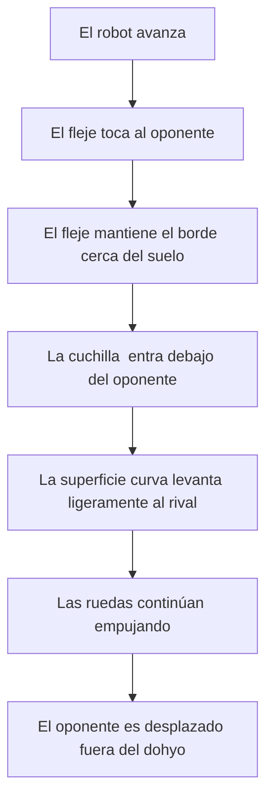

# Robot Mini Sumo RC


## 1. Descripción del proyecto

Este proyecto consiste en el diseño y construcción de un robot **Mini Sumo controlado por radiofrecuencia (RC)**.

El robot está diseñado para empujar al oponente fuera del *dohyo* mediante un sistema de tracción diferencial y un mecanismo frontal compuesto por:

- Una estructura principal fabricada mediante impresión 3D en PLA.
- Un fleje metálico flexible colocado en la parte frontal.
- Una placa de latón utilizada como superficie de ataque.
- Una geometría frontal curva o inclinada para levantar ligeramente al oponente.
- Dos ruedas motrices controladas de manera independiente.

El objetivo del diseño es conseguir que el borde frontal entre por debajo del robot contrario y transfiera la fuerza generada por los motores hacia el oponente.

---

## 2. Objetivos del diseño

### Objetivo general

Diseñar y fabricar un robot Mini Sumo RC compacto, resistente y funcional, capaz de desplazarse con precisión y empujar a otro robot fuera del área de combate.

### Objetivos específicos

- Fabricar el chasis principal mediante impresión 3D.
- Mantener el robot dentro de las dimensiones y peso permitidos por el reglamento.
- Colocar el centro de masa lo más bajo posible.
- Diseñar una parte frontal capaz de introducirse debajo del oponente.
- Proteger los componentes electrónicos y mecánicos.
- Conseguir suficiente tracción en las ruedas.
- Facilitar el montaje y mantenimiento del robot.

> **Nota:** Las dimensiones son 9.74 X 9.5 X 4.65 cm y el peso máximo se aproxima a 487 gramos con la placa de latón, el fleje y la PCB instalada.

---

## 3. Vista general del diseño

### Vista superior

La vista superior permite observar la distribución general del robot, la zona destinada a los componentes internos y el ancho del mecanismo frontal.


### Vista lateral

La vista lateral muestra el perfil del chasis, la posición de la rueda y la geometría curva o inclinada de la parte frontal.


---

## 4. Diseño mecánico

El robot está compuesto por cuatro elementos mecánicos principales:

1. Chasis inferior.
2. Soporte superior.
3. Sistema de tracción.
4. Mecanismo frontal de ataque.

### 4.1 Chasis

El chasis es la estructura que soporta:

- Motores.
- Ruedas.
- Batería.
- Controlador.
- Receptor RC.
- Drivers de los motores.
- Mecanismo frontal.

El diseño debe mantener la mayor cantidad posible de masa cerca del suelo para disminuir el riesgo de volcadura.

### 4.2 Estructura de PLA

La estructura principal se fabricará en **PLA mediante impresión 3D**.

El PLA fue seleccionado debido a las siguientes características:

- Facilidad de impresión.
- Buena rigidez.
- Bajo costo.
- Disponibilidad.
- Posibilidad de modificar rápidamente el diseño.
- Fabricación de geometrías personalizadas.

Sin embargo, el PLA puede fracturarse ante impactos fuertes. Por esta razón, el espesor de las paredes y la orientación de impresión han sido diseñadas con precaución.

---

## 5. Mecanismo frontal

El mecanismo frontal tiene la función de entrar por debajo del robot oponente y dirigirlo hacia arriba mientras las ruedas proporcionan la fuerza de empuje.

Está compuesto por:

- Un fleje metálico.
- Una placa de latón.
- Un soporte frontal curvo de PLA.
- 
### 5.1 Fleje metálico

El fleje será colocado frente a la estructura de PLA y aljeado de la placa de latón con fines de cumplir el reglamento

Sus principales funciones son:

- Permitir una pequeña deformación elástica.
- Compensar pequeñas irregularidades del piso.
- Absorber parte de los impactos.
- Evitar que todo el golpe se transmita directamente al PLA.

El fleje no debe ser demasiado flexible, porque la placa podría levantarse durante el avance. Tampoco debe ser demasiado rígido, porque perdería la capacidad de adaptarse a la superficie.

### 5.2 Placa de latón

La placa de latón será la pieza que tendrá contacto directo con la superficie del chasis.

El latón fue considerado debido a que:

- Puede fabricarse con un espesor pequeño.
- Tiene mayor rigidez que una pieza impresa.
- Agrega masa en la parte frontal e inferior del robot.
- Puede cortarse, perforarse y lijarse con herramientas convencionales.

> La placa no debe tener filos peligrosos. El borde deberá cumplir con las reglas de seguridad de la competencia.

### 5.3 Geometría frontal curva

La parte frontal utiliza una transición curva o inclinada, en lugar de depender únicamente de una navaja completamente plana.

Esta geometría busca:

- Introducir el borde frontal debajo del oponente.
- Levantar progresivamente la parte frontal del robot contrario.
- Reducir la posibilidad de que el oponente golpee directamente el chasis.
- Cubrir parte del frente del robot.
- Dirigir la fuerza del oponente hacia la estructura inferior.

La curva deberá ser suave para evitar que el robot contrario encuentre un punto donde pueda atorarse.

---

## 6. Funcionamiento mecánico del frente

El funcionamiento esperado del mecanismo frontal es el siguiente:



---

## 7. Sistema de tracción

El robot utiliza un sistema de **tracción diferencial**.

Cada rueda es accionada por un motor independiente:

- Motor izquierdo.
- Motor derecho.

El movimiento del robot se obtiene variando el sentido y la velocidad de cada motor.

| Motor izquierdo | Motor derecho | Movimiento |
|---|---|---|
| Adelante | Adelante | Avanzar |
| Atrás | Atrás | Retroceder |
| Atrás | Adelante | Girar a la izquierda |
| Adelante | Atrás | Girar a la derecha |
| Detenido | Adelante | Giro suave a la izquierda |
| Adelante | Detenido | Giro suave a la derecha |

---

## 8. Distribución de componentes

La distribución interna deberá considerar los siguientes criterios:

- Batería colocada en la zona inferior.
- Centro de masa bajo.
- Peso distribuido sobre las ruedas motrices.
- Electrónica protegida contra impactos.
- Cables alejados de las ruedas.
- Acceso al interruptor principal.
- Fácil conexión y desconexión de la batería.
- Espacio para desmontar motores y ruedas.
- Refuerzo en los puntos de unión del fleje.

### Distribución propuesta

```text
PARTE FRONTAL
┌─────────────────────────────┐
│ Fleje y placa de latón      │
├─────────────────────────────┤
│ Batería / peso frontal      │
│                             │
│ Controlador y drivers       │
│                             │
│ Motor izquierdo   Motor derecho
│ Rueda izquierda   Rueda derecha
└─────────────────────────────┘
PARTE TRASERA
```

---

## 9. Lista de materiales

La siguiente tabla presenta los componentes electrónicos, mecánicos y de alimentación seleccionados para la construcción del robot Mini Sumo RC.

| No. | Part Number / SKU | Descripción | Especificaciones técnicas | Fabricante | Proveedor | Cant. | Unidad | Precio unitario (MXN) | Precio total (MXN) | Subsistema |
|---:|---|---|---|---|---|---:|---|---:|---:|---|
| 1 | TB6612FNG | Driver dual de motor DC | Dual H-bridge, 1.2 A por canal, alimentación lógica de 3 a 5 V, 15 V máximo para motores | Toshiba | Mercado Libre | 2 | pza | $88.56 | $442.80 | PCB Mini Sumo |
| 2 | Radiolink T8S + R8EF | Transmisor remoto de 8 canales con receptor | Sistema de radio control de 2.4 GHz, receptor compatible con señales PWM para servos | Radiolink | AliExpress | 1 | pza | $1,080.46 | $1,080.46 | PCB Mini Sumo |
| 3 | DFR0868 | Tarjeta Beetle ESP32-C3 | ESP32-C3 RISC-V, Wi-Fi, Bluetooth, 4 MB Flash, 400 KB SRAM, USB-C y lógica de 3.3 V | DFRobot | UElectronics | 1 | pza | $215.00 | $215.00 | PCB Mini Sumo |
| 4 | CAP-CER-224 | Capacitor cerámico 224 | 220 nF, 50 V, X7R, SMD o encapsulado THT | — | — | 1 | pza | $2.00 | $2.00 | PCB Mini Sumo |
| 5 | CAP-CER-104 | Capacitor cerámico 104 | 100 nF, 50 V, X7R, SMD o encapsulado THT | — | — | 1 | pza | $2.00 | $2.00 | PCB Mini Sumo |
| 6 | HEADER-F | Tira de pines hembra | Paso de 2.54 mm, configuración 1 × 40; se utilizan 3 tiras | — | — | 3 | tira | $6.00 | $18.00 | PCB Mini Sumo |
| 7 | HEADER-M | Tira de pines macho | Paso de 2.54 mm, configuración 1 × 40 | — | — | 1 | tira | $6.00 | $6.00 | PCB Mini Sumo |
| 8 | RES-220 | Resistencia de 220 Ω | 220 Ω, 1/4 W, tolerancia de 5 % | — | — | 1 | pza | $1.00 | $1.00 | PCB Mini Sumo |
| 9 | JST-2P | Conector JST de 2 pines, macho y hembra | Tipo JST-PH o JST-XH, paso de 2.54 mm, 2 pines | — | — | 2 | par | $2.00 | $4.00 | PCB Mini Sumo |
| 10 | LED-5MM | LED de 5 mm | LED estándar de 5 mm, color por definir, corriente nominal de 20 mA | — | — | 1 | pza | $2.00 | $2.00 | PCB Mini Sumo |
| 11 | SW-3P | Interruptor de 3 pines | Interruptor deslizante o tipo toggle, 3 terminales | — | — | 1 | pza | $3.50 | $3.50 | PCB Mini Sumo |
| 12 | BORNERA | Bornera de tornillo | Paso de 2.54 o 5.08 mm, 2 pines | — | — | 1 | pza | $7.00 | $7.00 | PCB Mini Sumo |
| 13 | XT30 | Conector XT30 macho y hembra | Conector de 30 A, acabado dorado, par macho-hembra | — | — | 2 | pza | $10.00 | $20.00 | PCB Mini Sumo |
| 14 | JUMPER | Jumper de 2.54 mm | Puente cortocircuitador para pines con separación de 2.54 mm | — | — | 1 | pza | $1.50 | $1.50 | PCB Mini Sumo |
| 15 | WS2812B | LED RGB NeoPixel opcional | Alimentación de 5 V, RGB direccionable, presentación de 5 mm o SMD | — | — | 2 | pza | $15.00 | $30.00 | PCB Mini Sumo |
| 16 | L7805 | Regulador de voltaje | Salida fija de 5 V, capacidad máxima aproximada de 1.5 A, encapsulado TO-220 | — | — | 1 | pza | $9.00 | $9.00 | PCB Mini Sumo |
| 17 | JS16544 | Motorreductor Core DC | Alimentación de 6 V, corriente nominal de 120 mA, velocidad de 400 RPM, corriente de bloqueo de 3.2 A y masa de 21 g | JSUMO | JSUMO | 2 | pza | $275.38 | $550.76 | Chasis |
| 18 | N/A | Placa de latón | Dimensiones aproximadas de 7 × 5 × 7.5 cm | N/A | N/A | 1 | pza | $80.00 | $80.00 | Chasis |
| 19 | N/A | Batería LiPo 3S de 450 mAh | Dimensiones de 21 × 16.5 × 63 mm, conector XT30U-F, voltaje nominal de 11.1 V y descarga de 75C | TATTU | AliExpress | 1 | pza | $477.21 | $477.21 | Alimentación |

### Costo estimado

El costo estimado de los componentes registrados es de:

**$2,952.23 MXN**

> Los precios son valores de referencia correspondientes a julio de 2026 y pueden cambiar según el proveedor, el costo de envío y la disponibilidad de los componentes.
---

## 10. Consideraciones de diseño

### Centro de masa

El centro de masa deberá ubicarse:

- Lo más bajo posible.
- Cerca de las ruedas motrices.
- Ligeramente hacia la parte frontal, si la tracción lo permite.

No se recomienda colocar demasiado peso delante de las ruedas, ya que podría disminuir la fuerza normal sobre ellas y reducir la tracción.

### Tracción

La fuerza máxima de empuje depende principalmente de la fricción entre las ruedas y el dohyo:

\[
F_{\text{tracción}} = \mu N
\]

Donde:

- \(F_{\text{tracción}}\) es la fuerza máxima que las ruedas pueden transmitir.
- \(\mu\) es el coeficiente de fricción.
- \(N\) es la fuerza normal aplicada sobre las ruedas.

Para mejorar la tracción se recomienda:

- Utilizar ruedas de goma o silicona.
- Mantener limpias las ruedas.
- Distribuir suficiente peso sobre el eje motriz.
- Evitar que la placa frontal levante las ruedas.
- Reducir deslizamientos durante el arranque.

### Resistencia del PLA

Los puntos con mayor posibilidad de falla son:

- Soportes de los motores.
- Uniones del fleje.
- Base de la placa frontal.
- Soportes de los ejes.
- Esquinas del chasis.
- Alojamientos de tornillos.

Estas zonas deberán tener mayor espesor, radios de redondeo y suficientes paredes de impresión.

---

## 11. Sistema de fijación del fleje

La unión entre el fleje y el chasis puede realizarse mediante:

- Tornillos con tuerca.
- Insertos térmicos.
- Placa de presión.
- Abrazadera mecánica.

No se recomienda depender únicamente de pegamento, porque los impactos pueden separar el fleje del PLA.

Una posible unión es:

```text
Tornillo
   ↓
┌───────────────┐
│ Placa de apoyo│
├───────────────┤
│ Fleje metálico│
├───────────────┤
│ Chasis de PLA │
└───────────────┘
   ↑
Tuerca o inserto
```

---

## 12. Pruebas propuestas

Antes de participar en una competencia deberán realizarse las siguientes pruebas:

### Prueba dimensional

- Verificar largo total.
- Verificar ancho total.
- Verificar altura.
- Confirmar que la placa frontal no exceda las dimensiones permitidas.

### Prueba de peso

- Medir el peso total del robot.
- Registrar el peso de cada componente.
- Reservar un margen para tornillos, cables y modificaciones.

### Prueba del fleje

- Comprobar que regrese a su posición original.
- Verificar que no se deforme permanentemente.
- Confirmar que mantenga la placa cerca del suelo.
- Revisar que no levante las ruedas.

### Prueba de impacto

- Realizar impactos controlados a baja velocidad.
- Revisar grietas en el PLA.
- Inspeccionar tornillos y soportes.
- Comprobar la alineación de la placa.

### Prueba de tracción

- Colocar el robot frente a una carga conocida.
- Incrementar gradualmente la potencia.
- Observar si las ruedas patinan.
- Modificar la distribución del peso si es necesario.

### Prueba de combate

- Probar contra un robot de masa similar.
- Evaluar el comportamiento de la placa frontal.
- Revisar si el oponente se atora en la curva.
- Comprobar la capacidad de giro y recuperación.

---

## 13. Tabla de resultados

| Prueba | Condición | Resultado | Observaciones | Acción correctiva |
|---|---|---|---|---|
| Dimensiones | Robot ensamblado | Pendiente | — | — |
| Peso | Robot ensamblado | Pendiente | — | — |
| Flexión del fleje | Carga frontal | Pendiente | — | — |
| Tracción | Máxima potencia | Pendiente | — | — |
| Impacto | Baja velocidad | Pendiente | — | — |
| Combate | Robot de prueba | Pendiente | — | — |

---

## 14. Mejoras futuras

- Optimizar la curvatura de la parte frontal.
- Reducir el peso de la estructura de PLA.
- Reforzar los soportes de los motores.
- Ajustar la rigidez del fleje.
- Probar diferentes espesores de latón.
- Incorporar insertos térmicos.
- Mejorar la adherencia de las ruedas.
- Diseñar una tapa desmontable.
- Probar diferentes distribuciones de peso.
- Fabricar una segunda versión del frente.

---

## 15. Estructura del repositorio

```text
MiniSumo-RC/
├── README.md
├── CAD/
│   ├── chasis/
│   ├── frente/
│   └── ensamble/
├── STL/
│   ├── chasis.stl
│   └── soportes.stl
├── planos/
│   ├── plano_chasis.pdf
│   ├── plano_fleje.pdf
│   └── plano_placa_laton.pdf
├── imagenes/
│   ├── vista_superior.png
│   ├── vista_lateral.png
│   └── ensamble_completo.png
├── electronica/
│   ├── diagrama_conexiones.png
│   └── lista_componentes.md
├── programacion/
│   └── minisumo_rc.ino
└── pruebas/
    ├── resultados.md
    └── fotografias/
```

---

## 16. Estado actual

- [x] Diseño conceptual del chasis.
- [x] Diseño preliminar del frente curvo.
- [x] Selección de PLA para la estructura.
- [x] Selección de fleje para el mecanismo frontal.
- [x] Selección de latón para la placa.
- [x] Definición de dimensiones finales.
- [ ] Definición del espesor del fleje.
- [X] Definición del espesor de la placa de latón.
- [X] Simulación del ensamble.
- [ ] Impresión del primer prototipo.
- [ ] Montaje de los componentes.
- [ ] Pruebas de tracción.
- [ ] Pruebas de impacto.
- [ ] Prueba de combate.

Link imágenes CAD: https://drive.google.com/drive/folders/1OM1vpRx8z40wZyZMhOcF_yiaXYCE_M9d?usp=sharing

---

## 17. Autores

Proyecto desarrollado por:

- **Nombre:** [Adolfo Javier Barrientos López, Marian Zamarripa Espinoza]
- **Institución:** Tecnológico de Monterrey, Campus León
- **Carrera:** Ingeniería Mecatrónica
- **Año:** 2026

---

## 18. Licencia

Este proyecto se distribuye únicamente con fines académicos y de desarrollo experimental.
